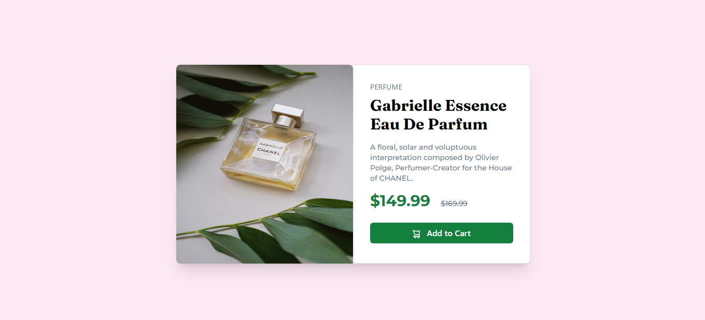

# Frontend Mentor - Product preview card component solution

This is a solution to the [Product preview card component challenge on Frontend Mentor](https://www.frontendmentor.io/challenges/product-preview-card-component-GO7UmttRfa). Frontend Mentor challenges help you improve your coding skills by building realistic projects. 

## Table of contents

- [Overview](#overview)
  - [The challenge](#the-challenge)
  - [Screenshot](#screenshot)
  - [Links](#links)
- [My process](#my-process)
  - [Built with](#built-with)
  - [Continued development](#continued-development)
- [Author](#author)

**Note: Delete this note and update the table of contents based on what sections you keep.**

## Overview
This is product preview card component for an e-commerce website
### The challenge

Users should be able to:

- View the optimal layout depending on their device's screen size
- See hover and focus states for interactive elements

### Screenshot

### Links

- Solution URL: 
- Live Site URL: 

## My process
I first implemented desktop version and then mobile version
### Built with

- Semantic HTML5 markup
- CSS custom properties
- Flexbox
- CSS Grid
- Mobile-first workflow
- [Tailwind](https://tailwindcss.com/) - CSS framework

### Continued development

I continued polishing my tailwind skills with this project. I want to practice tailwind and react more and more in future.

## Author

- Website - [Numan Iftikhar](https://numan-iftikhar.github.io/product-preview-card-component-FEM/)
- Frontend Mentor - [@numan-iftikhar](https://www.frontendmentor.io/profile/numan-iftikhar)
- Twitter - [@yourusername](https://twitter.com/home)
